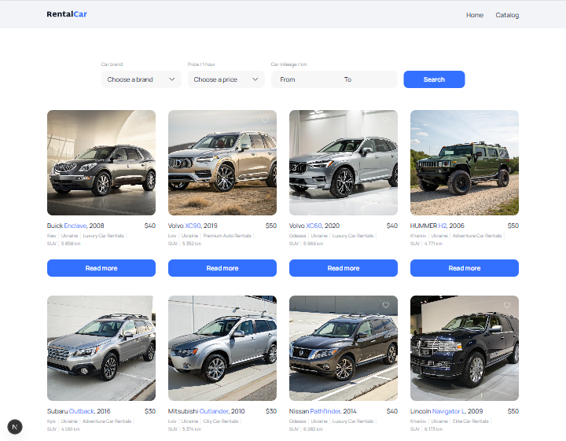
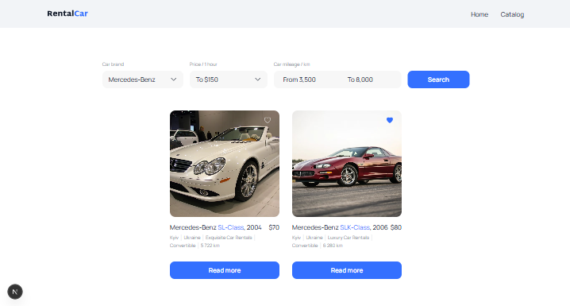
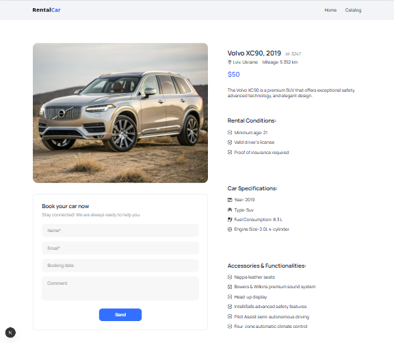
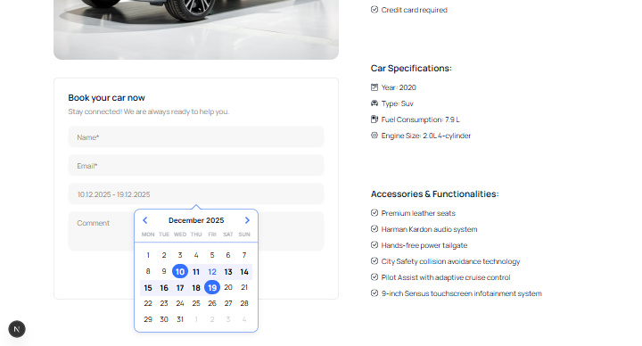

# 🚗 Car Rental App

🏠 Головна сторінка


Сучасний веб-додаток для оренди автомобілів, побудований на **Next.js**, **React**, **TypeScript** та **Zustand**.  
Підтримує каталог авто, фільтри, деталі автомобілів та бронювання.

---

## 🌟 Особливості

- 📋 **Каталог авто**  
    
  Адаптивна сітка з кнопкою "Load More".

- 🔍 **Фільтри**  
    
  За брендом, ціною та пробігом.

- 🚘 **Детальна сторінка авто**  
    
  Опис, характеристики та умови оренди.

- 📝 **Форма бронювання**  
    
  Перевірка введених даних.

- 🌐 Підтримка зовнішніх зображень (Unsplash, Cloudinary, API)
- ⚡ Управління станом через **Zustand**
- 🎨 Стилізація через **CSS Modules** та глобальні стилі

---

## 🛠 Використані технології

| Категорія       | Технології                |
| --------------- | ------------------------- |
| ⚡ Фреймворк    | Next.js                   |
| ⚛ UI            | React                     |
| 📝 Типізація    | TypeScript                |
| 📦 Стан додатку | Zustand                   |
| 🌐 HTTP клієнт  | Axios                     |
| 📅 Календар     | React Datepicker          |
| 🎨 Стилі        | CSS Modules + globals.css |
| 🔍 Лінтинг      | ESLint + Prettier         |

---

## 📁 Структура проєкту

````text
car-rental-app/
├─ public/
│  └─ images/
├─ src/
│  ├─ app/
│  │  ├─ catalog/
│  │  │  ├─ [id]/
│  │  │  │  └─ page.tsx
│  │  │  ├─ catalog.module.css
│  │  │  └─ page.tsx
│  │  ├─ catalog.module.css
│  │  ├─ globals.css
│  │  ├─ home.module.css
│  │  ├─ layout.tsx
│  │  └─ page.tsx
│  ├─ components/
│  │  ├─ CarBookingForm/
│  │  │  ├─ CarBookingForm.tsx
│  │  │  └─ CarBookingForm.module.css
│  │  ├─ CarCard/
│  │  │  ├─ CarCard.tsx
│  │  │  └─ CarCard.module.css
│  │  ├─ CarDetailsClient/
│  │  │  ├─ CarDetailsClient.tsx
│  │  │  └─ CarDetailsClient.module.css
│  │  ├─ FilterComponent/
│  │  │  ├─ FilterComponent.tsx
│  │  │  └─ FilterComponent.module.css
│  │  ├─ Header/
│  │  │  ├─ Header.tsx
│  │  │  └─ Header.module.css
│  │  └─ Loader/
│  │     ├─ Loader.tsx
│  │     └─ Loader.module.css
│  ├─ services/
│  │  └─ carApi.ts
│  ├─ store/
│  │  └─ carStore.ts
│  └─ types/
│     └─ car.ts
├─ .gitignore
├─ eslint.config.mjs
├─ next.config.ts
├─ package.json
└─ tsconfig.json

## 💻 Установка та запуск

1. Встановлення залежностей:

```bash
npm install
# або
yarn install
2. Запуск у режимі розробки:

npm run dev
# або
yarn dev

Відкрийте http://localhost:3000

3. Збірка для продакшн:

npm run build
npm start
# або
yarn build
yarn start

4. Лінтинг коду:

npm run lint
# або
yarn lint


⚡ Налаштування
Next.js:

// next.config.ts
images: {
  remotePatterns: [
    { protocol: "https", hostname: "images.unsplash.com", pathname: "/**" },
    { protocol: "https", hostname: "ac.goit.global", pathname: "/**" },
    { protocol: "https", hostname: "res.cloudinary.com", pathname: "/**" }
  ]
}
TypeScript:

"baseUrl": "./",
"paths": { "@/*": ["src/*"] }

ESLint + Prettier: підтримка Next.js + TypeScript, ігнорує /node_modules, /build, /out, .next, .env*, лог-файли.

🎨 Стилі
-Використовується шрифт Manrope по всьому додатку

-CSS Modules для компонентів

-Глобальні стилі у globals.css

-Чистий та сучасний UI: кнопки, картки, форми

📌 Git & .gitignore
Ігнорує:

/node_modules, /build, /out, .next, .env*, лог-файли, *.tsbuildinfo

TypeScript: next-env.d.ts

📌 Автор

[https://github.com/pbiryuk]
````
